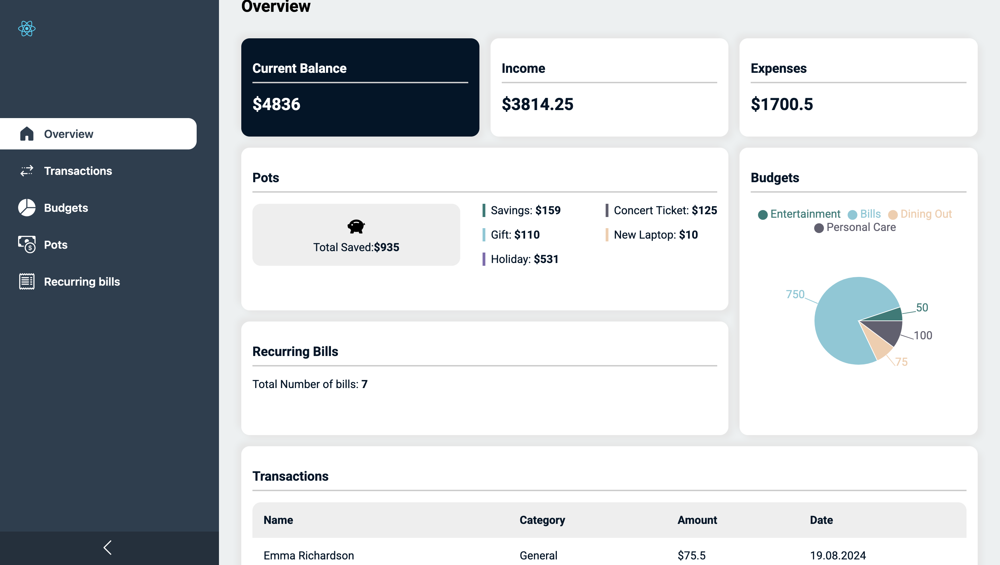
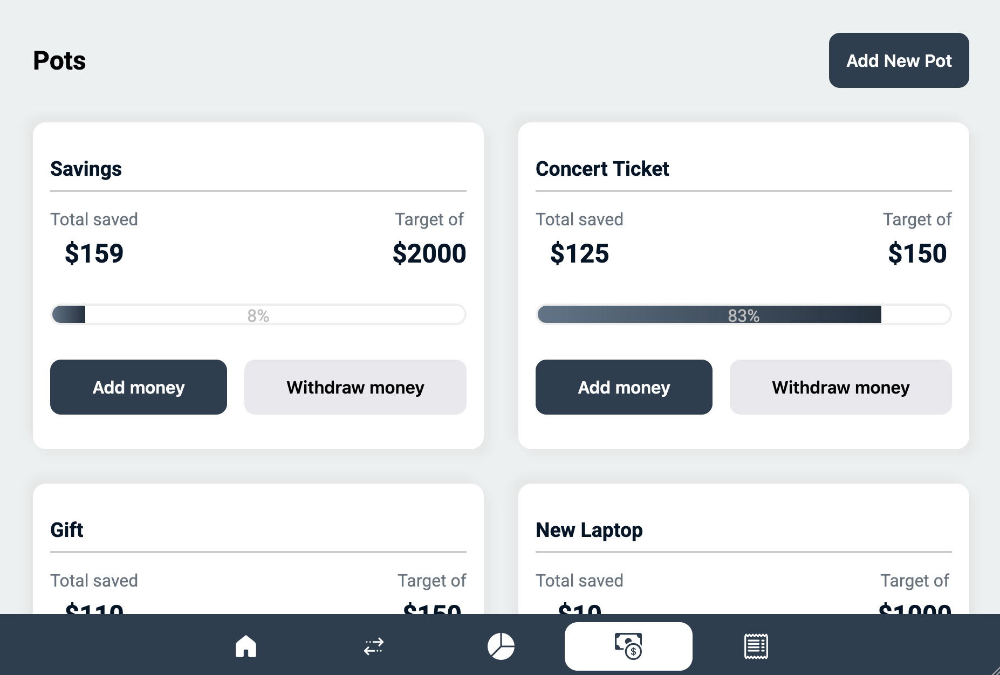
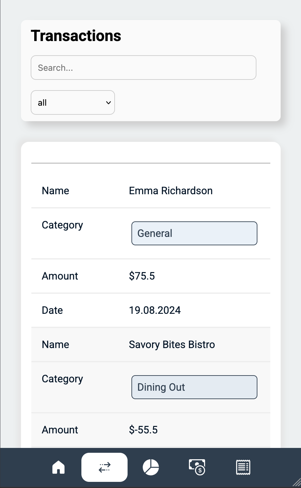

# Personal Finance Web App

## Desktop Design



## Tablet Design



## Mobile Design



  

## Installation

To install and set up the project, follow these steps:

  

1. Clone the repository:

```sh

git clone https://github.com/Bahadurshax/Personal-Finance-App.git

```

2. Navigate to the project directory:

```sh

cd Personal-Finance-App

```

3. Install the dependencies:

```sh

npm install

```

  

## Usage

To start the development server, run:

```sh

npm run dev

```

## Tech Stack Used

### Frontend
- **React**: A JavaScript library for building User Interfaces
- **Vite**: Fast build tool for React
- **Recharts**: A charting library built on React components.

### Styling
- **CSS**: Cascading Style Sheets for styling the application


## Project Structure


### Root Directory

- `.gitignore`: Specifies files and directories to be ignored by Git.
- `eslint.config.js`: Configuration file for ESLint.
- `index.html`: The main HTML file for the application.
- `package.json`: Contains project metadata and dependencies.
- `vite.config.js`: Configuration file for Vite.

### Public Directory

- `public/data/data.json`: Contains sample data for the application.

### Source Directory (`src`)

- `src/App.css`: Global styles for the application.
- `src/App.jsx`: Main application component.
- `src/index.css`: Additional global styles.
- `src/main.jsx`: Entry point for the React application.
- `src/utils.js`: Utility functions.


#### Components Directory
Contains reusable components

- `src/components/Button/`: Contains `Button` component and its styles.
- `src/components/Card/`: Contains `Card` component and its styles.
- `src/components/Label/`: Contains `Label` component and its styles.
- `src/components/List/`: Contains `List` component and its styles.
- `src/components/Modal/`: Contains `Modal` component and its styles.
- `src/components/Sidebar/`: Contains `Sidebar` component and its styles.

#### Context Directory

- `src/context/FinanceContext.jsx`: Provides a Finance Context Provider and the useFinanceData() hook to manage the state

#### Pages Directory

- `src/pages/Bills/`: Contains `BillsPage` component and its styles.
- `src/pages/Budgets/`: Contains `BudgetsPage` component and its styles.
- `src/pages/Overview/`: Contains `OverviewPage` component and its styles.
- `src/pages/Pots/`: Contains `PotsPage` component and its styles.
- `src/pages/Transactions/`: Contains `TransactionsPage` component and its styles.
